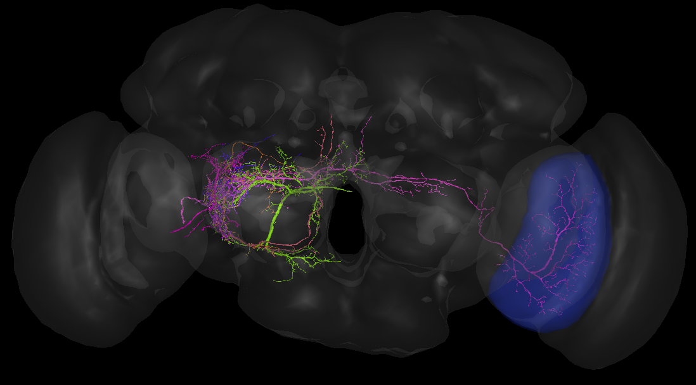
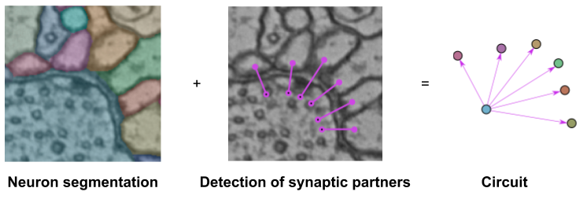

# SynfulCircuit: A small library for querying neural circuits

This python-based library allows to query and further analyze neural circuits based on predicted synaptic partners and segmented neurons in volumetric Electron-Microscopy datasets of brain tissue.

## Example: Synaptic Partners in a Whole-Brain Drosophila EM dataset (FAFB)
In the FAFB dataset \[Zheng et al. 2018\], 244M predicted synaptic partners \[Buhmann et al. 2019\] have been intersected with an automatically generated neuron segmentation \[Li et al. 2019\].
This library allows to query the combined dataset.

For instance, for a given neuron segment id, all up-and downstream neurons can be retrieved. In this example, the downstream neuron partners of the pink neuron projecting from the lobula (brain area marked in blue, part of the visual pathway) are displayed (using neuroglancer).

See [this jupyter notebook](examples/synful_fafb_query_circuit.ipynb) for more details.

## Background: Circuit Reconstruction
In volumetric EM datasets, neurons need to be identified together with synapses to be able to reconstructed the neural circuit (the Connectome).
In this tiny example, detected synaptic partners intersected with a neuron segmentation is used to retrieve the underlying neural circuit:

